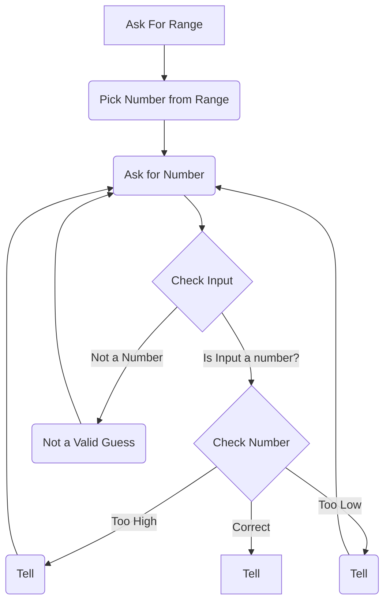

Guessing game begins by asking for a number range from player, after the number is picked, you will receive the number. Then the input will be checked, is it a number? Is it a valid guess? Once it is established that it is a valid number, then it will be checked to see if it too high, too low, or correct. This will then return us to ask for number.